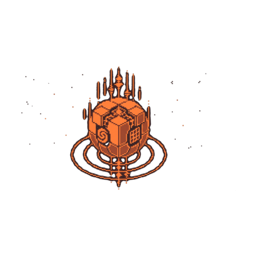

# Crateria

<p align="center">
  
</p>

<p align="center">
  <strong>Linux desktop software in Rust</strong> — Wayland-native tools,
  signed package repos, and focused utilities.
</p>

<p align="center">
  <a href="https://github.com/crateria">github.com/crateria</a>
  ·
  <a href="https://crateria.github.io/packages/">packages</a>
  ·
  <a href="https://github.com/crateria/brand">brand kit</a>
</p>

---

## Products

| | Repo | What it is |
|---|------|------------|
|  | **[trance](https://github.com/crateria/trance)** | Modular Wayland screensaver daemon (CLI, TUI, optional COSMIC applet) |
|  | **[trance-plugins](https://github.com/crateria/trance-plugins)** | Official screensaver effects (beams, storm, radar, hearth, …) |
|  | **[morphball](https://github.com/crateria/morphball)** | Secure archive manager (CLI + TUI) with zip-slip path checks |
|  | **[packages](https://github.com/crateria/packages)** | APT + DNF repositories on GitHub Pages |
| | **[brand](https://github.com/crateria/brand)** | Canonical icons, heroes, and org avatar assets |

---

## Install (any product)

Add the Crateria package repository once, then install with `apt` or `dnf`.

### Debian / Ubuntu / Pop!_OS

```bash
sudo mkdir -p /etc/apt/keyrings
sudo curl -fsSL https://crateria.github.io/packages/apt/crateria-keyring.gpg \
  -o /etc/apt/keyrings/crateria.gpg
echo "deb [arch=amd64 signed-by=/etc/apt/keyrings/crateria.gpg] https://crateria.github.io/packages/apt stable main" \
  | sudo tee /etc/apt/sources.list.d/crateria.list
sudo apt update
sudo apt install trance   # or: morphball
```

### Fedora

```bash
sudo curl -fsSL https://crateria.github.io/packages/rpm/crateria.repo \
  -o /etc/yum.repos.d/crateria.repo
sudo dnf install trance   # or: morphball
```

Package index: **https://crateria.github.io/packages/**

---

## Repositories

| Repository | Role |
|------------|------|
| [crateria/crateria](https://github.com/crateria/crateria) | This umbrella / landing page |
| [crateria/brand](https://github.com/crateria/brand) | Brand kit (source of truth for icons) |
| [crateria/trance](https://github.com/crateria/trance) | Screensaver core |
| [crateria/trance-plugins](https://github.com/crateria/trance-plugins) | Effects |
| [crateria/morphball](https://github.com/crateria/morphball) | Archive tool |
| [crateria/packages](https://github.com/crateria/packages) | APT/DNF pool + Pages site |
| [crateria/.github](https://github.com/crateria/.github) | Org profile + community health |

---

## Brand

Icons and marketing assets live in **[crateria/brand](https://github.com/crateria/brand)**.  
After a machine wipe, clone that repo for masters and size ladders — not local Downloads.

---

## Contributing

Prefer small, focused changes on the **product** repository that owns the code.
Org-wide notes: [CONTRIBUTING](https://github.com/crateria/.github/blob/main/CONTRIBUTING.md).

## Security

Report product issues on the product repo’s **Security** tab.  
Org policy: [SECURITY.md](https://github.com/crateria/.github/blob/main/SECURITY.md).

## License

[Apache-2.0](LICENSE) · Copyright 2026 [Crateria](https://github.com/crateria)
